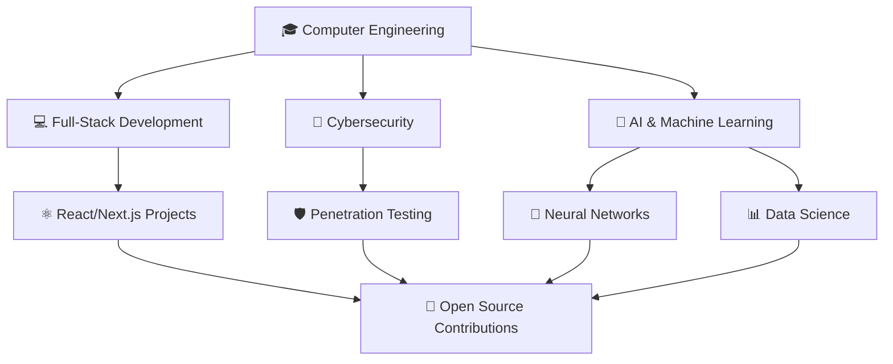

# <div align="center">🚀 Welcome to FF9's Digital Universe 🚀</div>

<div align="center">
  
```ascii
███████╗███████╗ █████╗ 
██╔════╝██╔════╝██╔══██╗
█████╗  █████╗  ╚██████║
██╔══╝  ██╔══╝   ╚═══██║
██║     ██║      █████╔╝
╚═╝     ╚═╝      ╚════╝ 
```

<h1>
  
  Hi there! I'm Francesco
  
</h1>

</div>

---

<div align="center">

### 🎯 Current Status: `BUILDING THE FUTURE`


</div>

## 🌍 About Me

```python
class Francesco:
    def __init__(self):
        self.name = "Francesco"
        self.location = "Cosenza, Italy 🇮🇹"
        self.education = "Computer Engineering Student"
        self.interests = [
            "Full-Stack Development 💻",
            "Cybersecurity 🔐", 
            "Artificial Intelligence 🤖",
            "Machine Learning 🧠",
            "Game Development 🎮"
        ]
        self.goal = "Become a Software Engineer & Change the World!"
        self.coffee_addiction = True ☕
    
    def say_hello(self):
        return "Let's build something amazing together! 🚀"

francesco = Francesco()
print(francesco.say_hello())
```

<div align="center">

### 🎮 **CLICK THE BUTTONS BELOW TO INTERACT!** 🎮

<details>
<summary>🎲 Random Tech Fact Generator</summary>

> **Did you know?** 
> The first computer bug was literally a bug! In 1947, Grace Hopper found an actual moth stuck in a relay of the Harvard Mark II computer.

</details>

<details>
<summary>🤖 AI Fun Facts</summary>

> **AI Fact #1:** The term "Artificial Intelligence" was coined in 1956 at a conference at Dartmouth College.
> 
> **AI Fact #2:** Neural networks are inspired by how neurons work in the human brain!
> 
> **AI Fact #3:** Machine Learning algorithms can now generate art, write code, and even compose music! 🎵

</details>

<details>
<summary>💡 Francesco's Quote of the Day</summary>

> *"Code is like humor. When you have to explain it, it's bad."* 😄
> 
> *"The best error message is the one that never shows up."* ✨
> 
> *"AI won't replace programmers, but programmers who use AI will replace those who don't."* 🤖

</details>

</div>

## 🛠️ Tech Arsenal

<div align="center">

### 💻 Languages & Frameworks


### 🤖 AI & Machine Learning


### 🔐 Cybersecurity Tools


### ⚡ Tools & Platforms


</div>

## 📊 GitHub Stats

<div align="center">


</div>

<div align="center">


</div>

## 🎯 Current Focus

<div align="center">



</div>

## 🏆 Achievements & Goals

- 🎓 **Currently:** Computer Engineering Student at University of Calabria
- 💼 **Goal:** Become a Software Engineer and contribute to innovative projects
- 🌱 **Learning:** Advanced AI/ML concepts, Cloud Architecture, DevSecOps
- 🔭 **Working on:** Full-stack applications with AI integration
- 🤝 **Open to:** Collaborate on open source projects and hackathons
- ⚡ **Fun fact:** I debug faster with coffee than without! ☕

## 🌐 Let's Connect!

<div align="center">

### 🤝 Ready to collaborate? Let's build the future together!

[](https://linkedin.com/in/ff9)
[](https://github.com/yourusername)
[](https://yourportfolio.com)
[](mailto:francesco@example.com)

</div>

---

<div align="center">

### 💭 *"The best way to predict the future is to invent it."* - Alan Kay


**Thanks for visiting! Have a great day! 🌟**

</div>

<!-- Easter Egg: ASCII Art Footer -->
<details>
<summary>🥚 Click for a surprise!</summary>

```
    🎉 CONGRATULATIONS! 🎉
    You found the easter egg!
    
         🤖 AI POWERED 🤖
        ╔══════════════════╗
        ║  KEEP CODING!    ║
        ║  STAY CURIOUS!   ║
        ║  BUILD THE       ║
        ║  FUTURE! 🚀      ║
        ╚══════════════════╝
         
    Thanks for exploring my profile!
    - Francesco (FF9) 💚
```

</details>
